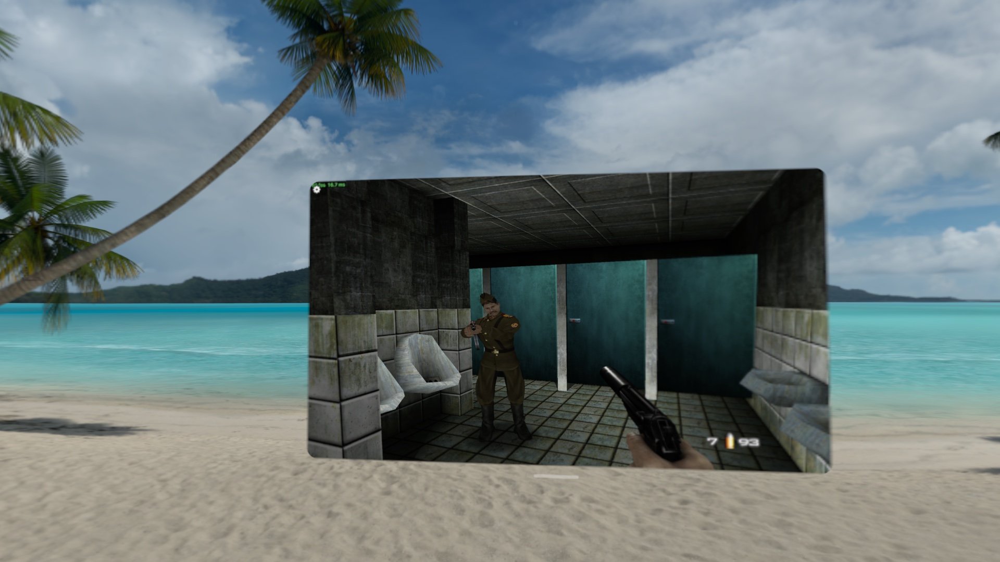

# GoldenEye 007 for iPhone & Apple Vision Pro

The **GoldenEye 007 XBLA remaster** — Rare's Xbox 360 remake, finished in 2007 and
never released — running natively on iPhone and Apple Vision Pro. This is a
*static recompilation*, not an emulator: the original PowerPC game code is
translated ahead of time into C++ and compiled for Apple silicon, with the Xbox
360 GPU, audio and kernel layers reimplemented on top of Vulkan (via MoltenVK) on
Metal. The remaster's signature feature — the instant switch between the 2007
remastered art and the original N64 look, mid-game, with no reload — works here
too.

Built on [GoldenEye-Recomp](https://github.com/SunJaycy/GoldenEye-Recomp) and the
[ReXGlue SDK](https://github.com/rexglue/rexglue-sdk).

Requires **iOS 16 or later**, or **Apple Vision Pro on visionOS 26 or later**.



---

## Install

**Add the SideStore source** — the easiest path, and the app auto-updates when new
versions ship:

| Device | Source URL |
| --- | --- |
| iPhone / iPad | `https://raw.githubusercontent.com/rebelancap/all-ports/main/apps-ios.json` |
| Apple Vision Pro | `https://raw.githubusercontent.com/rebelancap/all-ports/main/apps-visionos.json` |

In [SideStore](https://sidestore.io) / [AltStore](https://altstore.io):
*Sources → **+** → paste the URL*, then install GoldenEye. This is a shared
source — it carries the other ports too.

On **Apple Vision Pro**, first install SideStore onto the headset with
[iloader](https://github.com/rebelancap/iloader/releases#release-visionos)
(SideStore/AltStore can't be installed on visionOS the usual way — iloader is what
gets SideStore there). Then add the source in SideStore exactly as above. No Xcode
or Dev Strap required.

**Prefer a manual install?** Download `goldeneye-xbla-<VERSION>-iOS.ipa` or
`goldeneye-xbla-<VERSION>-visionOS.ipa` from the
[latest release](../../releases/latest) and install it through SideStore/AltStore
yourself (iPhone can also use [Sideloadly](https://sideloadly.io)).

## You bring the game

**The app ships with no game data.** There is no game content, no executable, no
textures and no audio in this repository or in the app — you supply the complete
file set yourself. GoldenEye 007 for Xbox 360 was cancelled and never sold, so
there is no store to buy it from and **we cannot help you obtain it, and won't
answer questions about where to find it.** Please don't ask, and don't post links
in the issue tracker.

If you already have the file set, this is where it goes:

1. Open the **Files** app.
2. Go to **On My iPhone → GoldenEye** (on the headset: **On My Apple Vision Pro →
   GoldenEye**).
3. Put your game files in a folder named exactly **`assets`**.

Either form of the file set works:

- **Extracted** — `assets/default.xex` (the November 2007 build), `assets/files/`
  (the asset tree), and the `.xwb` / `.xsb` / `.xgs` sound banks beside them.
- **Unextracted** — drop the whole container folder in as `assets`; the app finds
  the package by its header and mounts it for you.

It is around 750 MB either way, so let the copy finish before tapping **Check
Again** on the first-run screen. That screen tells you exactly what it found and
what is missing, including the case where `files/original` or `files/new` is
absent — those two folders are the N64 and remastered model sets, so a set missing
one boots but the visual toggle only half-works.

Your settings and saves live in the app's own folder, separate from the game data.

## Controls

**Game controllers are the primary input** — this is a twin-stick console shooter
and it plays best with a pad. Pair any MFi / Xbox / PlayStation controller and it
works with the game's own Xbox 360 layout, unchanged.

- **RB** — instantly flip between the remastered and original N64 graphics, any
  time, including mid-firefight.
- **LB** — the hidden debug menu, if you enable it in Settings.

**Touch controls** appear automatically when no controller is connected: a
floating move stick on the left half of the screen, drag anywhere on the right to
look, and buttons for **FIRE**, **AIM** (press and drag to aim), **USE**,
**CROUCH**, **RELOAD**, **SWAP**, **GADGET** and the menu. While AIM is held a
second FIRE appears under the left thumb, mirroring the right one, so you can
aim with one hand and shoot with the other. Every button can be moved — Settings
→ Controls → *Customize Touch Layout*. Look sensitivity, invert axes (separately
for each), button opacity, haptics and the crosshair style are all in Settings.

**On Apple Vision Pro**, a paired controller is strongly recommended. Without one,
the touch overlay is driven by pinch: a pinch anywhere in the left half of the
window raises the move stick, and pinching the buttons presses them.

## Settings

Reachable from the gear in the corner of the menus, or from the pause menu.

**Graphics**
- **Original N64 graphics** — the same instant flip as the RB shortcut.
- **Antialiasing** — *Off* (the default; single-sample host targets) or *Game (4x
  MSAA)*, which is what the original renders with. Takes effect on next launch.
- **Resolution** — *720p* (the game's native resolution), *1440p (2x)* or *2160p
  (3x)*. Takes effect on next launch. Honestly: **on Apple Vision Pro, 1440p is the
  default and holds 60 fps; 2160p is sharper but runs around 45 fps.** On iPhone,
  **720p is the default** — the higher settings render four and nine times the
  pixels respectively and the phone is thermally limited well before that.

**Display** — frame rate readout, a detailed performance readout, and a 60/30 fps
choice (30 halves the GPU work and heat for long sessions).

**Controls** — look sensitivity, invert vertical/horizontal, on-screen controls
auto/on/off, button opacity, haptics, crosshair style, and the touch layout editor.

**Audio** — master volume, mute, and how the app shares audio with other apps.

**Diagnostics** — live frame rate and the device's thermal state. Worth checking
before drawing conclusions about performance: a frame rate measured at "serious"
is not comparable with one measured at "nominal".

Settings persist across relaunches. A few rows say "takes effect on next launch"
and mean it.

## Performance

Measured on real hardware, at the default settings for each platform, playing the
Dam.

| Device | Resolution | Antialiasing | Frame rate |
| --- | --- | --- | --- |
| Apple Vision Pro | 1440p (2x, default) | Off | ~59 fps, thermal nominal |
| Apple Vision Pro | 2160p (3x) | Off | ~45 fps |
| iPhone Air | 720p (default) | Off (default) | 60 fps |
| iPhone Air | 720p | Game (4x MSAA) | 32–38 fps |

The game is GPU-bound on both platforms; the CPU side of the recompilation is not
the limit. Long sessions on either device will throttle as the hardware heats up.

## Known issues

- **Brief flicker or missing effects in the first session after installing.** The
  graphics driver compiles each shader the first time it is used. The app never
  blocks a frame waiting for one — it draws the frame without that effect for a
  few frames instead — so the first time you see a new weapon or explosion there
  can be a flash of something missing. Compiled shaders are cached, so it stops
  happening after the first session and does not come back until the next update.
- **The graphics switch in Settings can fall out of step with the RB shortcut.**
  Flipping with RB doesn't update the switch; toggle it once and they resync.
- **Multiplayer is not supported.** The campaign is the product. Split-screen and
  the online modes are out of scope for now.
- **Sideloaded apps expire.** A free Apple account signs for 7 days, a paid
  developer account for a year. SideStore refreshes them in the background — open
  it and let it re-sign if the app stops launching.

## Building from source

Requires macOS with the Xcode command line tools, plus `cmake` and `ninja`
(`brew install cmake ninja`), and **your own copy of the game files** — the
recompiler runs over your `default.xex` as part of the build.

```sh
scripts/bootstrap.sh              # vendor upstream @ pin + apply the overlay
scripts/build-macos.sh            # recompile the game code -> generated/ (once)
scripts/build-ios.sh ios          # the iOS app
scripts/build-ios.sh visionos     # the visionOS app
scripts/make-ipa.sh               # -> dist/goldeneye-xbla-<VERSION>-iOS.ipa
scripts/make-ipa.sh --visionos    # -> dist/goldeneye-xbla-<VERSION>-visionOS.ipa
```

Upstream GoldenEye-Recomp and the ReXGlue SDK are vendored unmodified and pinned
by commit; every local change is a reviewable patch under `patches/`, applied by
`scripts/apply-overlay.sh`. The recompiled game code (`generated/`) and any game
data are never committed.

## Credits

- [GoldenEye-Recomp](https://github.com/SunJaycy/GoldenEye-Recomp) by **SunJaycy**
  — the PC recompilation this port is built on: the function boundaries, the game
  hooks, the menus, the mouse-look work, and the Community Edition patch set as
  runtime patches.
- [ReXGlue SDK](https://github.com/rexglue/rexglue-sdk) — the ahead-of-time
  PowerPC→C++ recompiler and the Xbox 360 runtime.
- [Xenia](https://xenia.jp) — ReXGlue's runtime is heavily derived from Xenia's
  GPU command processor, kernel/XAM emulation and XMA audio work.
- **BeanTools Community Edition** — the door, portal, near-clip and audio-distance
  fixes, and the 3D-positioned sound effects, carried forward and on by default.
- [MoltenVK](https://github.com/KhronosGroup/MoltenVK) — Vulkan on Metal.
- GoldenEye 007 © Rare / Nintendo / MGM / Danjaq. This project is not affiliated
  with, endorsed by, or connected to any of them.

## License

<!-- TODO-CONFIRM: proposed default is The Unlicense, matching upstream
     GoldenEye-Recomp. Confirm before the release is cut. -->

Released under **The Unlicense** (see `LICENSE`), matching upstream
GoldenEye-Recomp. This covers the porting work in this repository only — it does
not and cannot grant any rights to the game itself.
